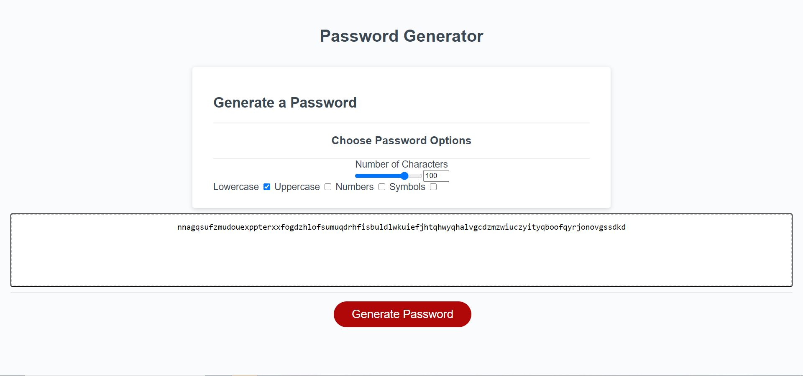

## Javascript Random Password Generator

## Description
This week's project was to build a functional random password generator, using mainly javascript, but features dynamically updated html / css. Using a pre-made framework of html. It had to feature choices for the user to select certain criteria for the password, such as the length of characters between 8-128, if they wanted lowercase/uppercase letters numbers, symbols or a combination of any or all of them. 

To do this, I utilised checkboxes to clearly display to the users their choices, but also to avoid having prompts and alerts which can be a little distracting.

## Difficulties

One of the primary difficulties i faced was with checking the users criteria using if statements, and how they had to be nested for them to work properly, if im honest im happy with how it turned out although i would like to improve my method to cut down on the number of if statements, as it's hard to follow and to check /debug 

## Features
This website features 4 checkboxes for the user to select certain password criteria alongside a slider and text box which are both linked for the user to select the length of password. 

Once the user has made their choices and presses the Generate buttons, the javascript creates 4 array from strings, then combines into another array for user selection and concatenates the arrays together for the password generation, then converts that back into a string for the user.

## Updates 
I would like to work on a few more things for this eventually, such as tooltips for when the user hovers over certain items to either tell them what it does or in the case of the slider what the minimum and maximum values are. I would also like to improve upon my solution of multiple nested if and else if statements to check what commands the user has entered  
 
## Website Preview
 
https://ben-j-st.github.io/password-generator/
